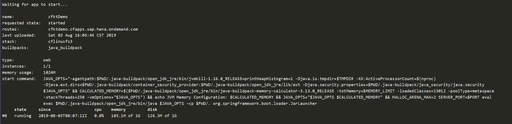
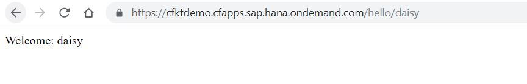

# Cloud Foundry CLI
## Download and Install
Since Cloud Foundry is open source software (OSS), you can download the latest release of components such as the cf CLI from GitHub and install them directly:
> 1. Go to https://github.com/cloudfoundry/cli/releases.
> 2. Download the installer for your platform, such as macOS X, Windows, Debian, or Red Hat.

Install the cf CLI by following the instructions for your operating system:
+ Install cf CLI on Windows
  > 1. Unpack the .zip file.
  > 2. Double-click the cf CLI executable.
  > 3. When prompted, click on Install, and then Close.
+ Install cf CLI on macOS X and Linux
  > 1. Open the .pkg | .deb | .rpm file.
  > 2. Follow the package installer wizard.
  > 3. When prompted, click on Install, then Close.

## Initial setup of the cf CLI 
After you've installed the cf CLI, verify that it works properly by typing the following command:

```$ cf```

If all goes well, you should see the cf CLI help text appear, looking something like this:


to see the version of the cf CLI that is installed, type the following command:

```$ cf --version```

## The cf CLI help command
Perhaps the most useful command when starting out with the cf CLI is this:

```$ cf help```

This allows you to see the available CLI commands and understand their usage and syntax. The cf CLI enables you to control a wide range of commands that help you deploy and configure your applications on Cloud Foundry.

## Finding cf CLI commands
Since there are many cf CLI commands available, it can be a bit overwhelming to find the command you are really interested in at a given point. If you have it available on your system, you can find commands containing cf CLI keywords using grep:

```$ cf help | grep 'service'```


**NOTE**: The Windows command prompt does not natively support bash prior to Windows 10, which is required for commands like grep. To use grep, you either have to use the git-bash shell provided during a git install, or in current releases of Windows, use the bash command in a Windows Command Prompt after installing the Windows Linux Subsystem. [Windows Reference Documentation here](https://docs.microsoft.com/en-us/windows/wsl/install-win10) 

## Deploying an application to Cloud Foundry
Now we just want to push a simple application to see it run on Cloud Foundry. To do that, we must do a few things:
1. Set the target Cloud Foundry instance so that our cf CLI knows where we are pushing our application bits. 
2. Log in to the targeted Cloud Foundry instance using the cf CLI.
3. Push our simple app.

### Step 1: Targeting SAP cf API endpoint
```$ cf api  https://api.cf.sap.hana.ondemand.com```


### Step 2: Logging into the Cloud Foundry API endpoint
```$ cf login```


### Step 3: Pushing a simple application

Downloading the [app code](./codes/demo)

Push the app to Cloud Foundry:

```$ cf push```

The app will be pushed to Cloud Foundry, and in the Terminal output you will see the URL to open in your browser in order to view the running application, like the following:



In the preceding example output, the running app can be found at https://cfktdemo.cfapps.sap.hana.ondemand.com/hello/daisy

Opening the browser will reveal the world's simplest Cloud Foundry application in all its glorious simplicity:

Congratulations! You've just deployed an application to Cloud Foundry.